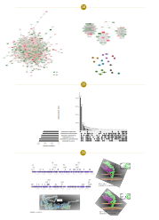

<head>
    <meta charset="UTF-8">
    <meta name="viewport" content="width=device-width, initial-scale=1.0">
    <title>Document</title>
    
</head>
<body>
  

  

</body>
<body>
  
 
    Hello, World!
  

</body>

I'm Thiago Mendonça, a Biotechnologist with a Master's degree in Biochemistry and Molecular Biology, currently in the final stages of completing my Ph.D. in Bioinformatics.

 My initial exposure to bioinformatics occurred during my undergraduate exchange program in Canada. The very first lesson was all about the Monte-Carlo Algorithm, followed by 5 hours of R prectice. It was a bit of a shock to me, so much math and computation! I was determined to avoid bioinformatics as much as possible. Until my Master's program, I had been exclusively involved in wet lab molecular biology techniques. However, my project in the Master's program required me to dig into transcriptomics, which meant 100% in silico work. To my surprise, I found myself developing an affinity for it. The endless possibilities and beautiful graphs were joy to my eyes. Now, I spend my time conducting detailed and in-depth computational analyses using programming languages such as Python, R, and Bash to perform various biological experiments and analyses. Take a quick look at it! 

 
<body>
  

    <h1 style="color:green;">Presenting Data in Graphs</h1>
  

</body>

 
<body>
  
 
    Project I
  

</body>

 "Pangenome of putative viral family"
 

  

 

1- FlowerPlot - intersections of gene content
 

2- Pangenomic rarefraction curve
 

3- Normalized heatmap of gene intersections
 

4- Heaps law calculation
 

5- PCA plot of gene content
 

 6- Boxplot of genomic features
 
 
<body>
  
 
    Project II
  

</body>

 "Genomic and Structural Analysis of Major Vault Potein in Bacteriophages"
 

  

7- Genomic representation of bacteriophages' genome, Reads mapping to assembled genome, Phylogenetic tree of new bacteriophages and reference ones

8- Phylogenetic tree of Eukaryotic, Prokaryotic and viral MVPs

9- Tertiary tructures of different MVPs compared do modelled phage MVPs p

<body>
  
 
    Project III
  

</body>

 "Characterization of SARS-CoV-2 and Human mutations on protein binding affinity"

  

10-

11-

12-

13-

<strong>
<body>
  
 
    Miscellaneous
  

</body>

  

14-

15-

16-

<body>
  

    <h1 style="color:green;">Education</h1>
  

</body>

 
 

Ongoing Doctorate degree in Bioinformatics (Federal University of Minas Gerais, Brazil).

Masters in Biochemistry and Molecular Biology (Federal University of Bahia, Brazil).

Bachelor in Biotechnology (Federal University of Bahia, Brazil with an exchange period at Carleton University, Canada).

 
<body>
  

    <h1 style="color:green;">Skills</h1>
  

</body>

 
#### Programming languages
<h>Bash, Python, R (and a bit of HTML just to make this website &#128517;)</h>
#### R packages
<h>ggplot2, pheatmap, reshape2, ploty, upsetplot </h>
### Softwares
<h>Pymol, Prodigy, alhpafold, gromacs, Hdock, figtree, mega, cytoscape, gephi, exatlas, virscan, proteinortho, miRWalk, STRING, CytoHubba, MCODE, Enrichr, CD-HIT, BLAST, Aragorn, Prodigal, GeneMarkS, MEME, hmmer, Cialign, SPAdes, VIRIDIC, VICTOR</h>
#### Databases
<h>GEO, PDB, NCBI, SRA, miRBase</h>
#### Other tools
<h>Github, Collab, Inkscape</h>

<body>
  

    <h1 style="color:green;">Publications</h1>
  

</body>

 

[Human variation in the protein receptor ACE2 affects its binding affinity to SARS-CoV-2 in a variant-dependent manner](https://www.tandfonline.com/doi/full/10.1080/07391102.2022.2042387)

[The evolution of ADAM gene family in eukaryotes](https://www.sciencedirect.com/science/article/pii/S0888754319308535?via%3Dihub)

[Characterization and Phylogenetic Insights into the First Viral Major Vault Proteins (MVPs), Identified in Bacteriophages from the Human Gut](https://www.biorxiv.org/content/10.1101/2023.11.10.566534v1)

[Vigilância Genômica em Saúde Pública](http://dx.doi.org/10.51781/97865869201853250)

[Gene duplication as a major force driving the genome expansion in some giant viruses](https://journals.asm.org/doi/10.1128/jvi.01309-23)

[Relatório DASA - 2022](https://dasa.com.br/genov/)

[Diferencas genéticas afetam como o coronavírus se liga as nossas células](https://www1.folha.uol.com.br/blogs/ciencia-fundamental/2022/04/diferencas-geneticas-afetam-como-o-coronavirus-se-liga-as-nossas-celulas.shtml?utm_source=sharenativo&utm_medium=social&utm_campaign=sharenativo)

[COVID-19: Mutação em proteina humana pode alterar a afinidade de variantes](https://www.em.com.br/app/noticia/bem-viver/2022/05/03/interna_bem_viver,1363929/covid-19-mutacao-em-proteina-humana-pode-alterar-a-afinidade-de-variantes.shtml)
